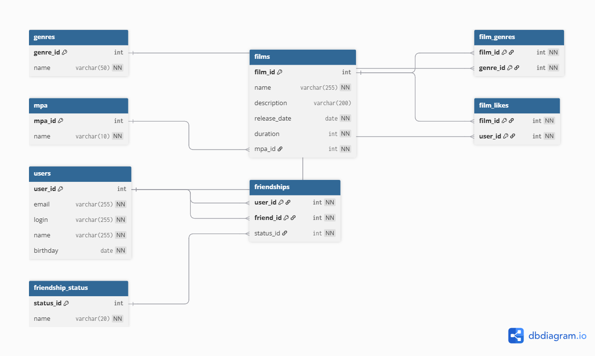

# java-filmorate

## ER-диаграмма



## Доработанная модель приложения

### Film

Сущность `Film` дополнена двумя новыми свойствами:

- жанры — у одного фильма может быть несколько жанров;
- рейтинг MPA — у фильма может быть только один рейтинг возрастного ограничения.

### User

Связь дружбы между пользователями дополнена статусом:

- `UNCONFIRMED` — заявка в друзья отправлена, но ещё не подтверждена;
- `CONFIRMED` — дружба подтверждена.

### В модели приложения добавлены сущности Genre, Mpa, а также статус дружбы FriendshipStatus.

## Описание схемы базы данных

В базе данных используются следующие таблицы:

- `users` — пользователи;
- `films` — фильмы;
- `mpa` — справочник рейтингов MPA;
- `genres` — справочник жанров;
- `film_genres` — связь фильмов и жанров;
- `film_likes` — лайки пользователей фильмам;
- `friendship_status` — справочник статусов дружбы;
- `friendships` — связи дружбы между пользователями.

## Пояснение по структуре

### Пользователи

Таблица `users` хранит основные данные пользователей:

- `user_id`
- `email`
- `login`
- `name`
- `birthday`

### Фильмы

Таблица `films` хранит основные данные фильмов:

- `film_id`
- `name`
- `description`
- `release_date`
- `duration`
- `mpa_id`

Рейтинг MPA вынесен в отдельную таблицу `mpa`, потому что это ограниченный набор фиксированных значений.

### Жанры

Жанры вынесены в отдельную таблицу `genres`, потому что один фильм может относиться сразу к нескольким жанрам.

Для связи фильмов и жанров используется отдельная таблица `film_genres`.

### Лайки

Один пользователь может поставить лайк многим фильмам, и один фильм может получить лайки от многих пользователей.

Для этого используется таблица `film_likes`.

### Дружба

Связь дружбы между пользователями хранится в таблице `friendships`.

Поля таблицы:

- `user_id` — пользователь, который инициировал связь;
- `friend_id` — второй пользователь;
- `status_id` — статус дружбы.

Статусы вынесены в отдельный справочник `friendship_status`.

Логика работы дружбы:

- если пользователь отправил заявку в друзья, создаётся запись со статусом `UNCONFIRMED`;
- после подтверждения дружбы связь считается подтверждённой;
- для подтверждённой дружбы в таблице хранятся две записи со статусом `CONFIRMED`, чтобы можно было быстро получать список друзей и общих друзей.

## Примеры запросов для основных операций

### Получить всех пользователей

```sql
SELECT user_id,
       email,
       login,
       name,
       birthday
FROM users;
```

### Получить пользователя по id

```sql
SELECT user_id,
       email,
       login,
       name,
       birthday
FROM users
WHERE user_id = ?;
```

### Получить все фильмы

```sql
SELECT f.film_id,
       f.name,
       f.description,
       f.release_date,
       f.duration,
       m.name AS mpa_name
FROM films AS f
LEFT JOIN mpa AS m ON f.mpa_id = m.mpa_id;
```

### Получить фильм по id

```sql
SELECT f.film_id,
       f.name,
       f.description,
       f.release_date,
       f.duration,
       m.name AS mpa_name
FROM films AS f
LEFT JOIN mpa AS m ON f.mpa_id = m.mpa_id
WHERE f.film_id = ?;
```

### Получить жанры фильма

```sql
SELECT g.genre_id,
       g.name
FROM film_genres AS fg
INNER JOIN genres AS g ON fg.genre_id = g.genre_id
WHERE fg.film_id = ?;
```

### Получить топ N популярных фильмов

```sql
SELECT f.film_id,
       f.name,
       COUNT(fl.user_id) AS likes_count
FROM films AS f
LEFT JOIN film_likes AS fl ON f.film_id = fl.film_id
GROUP BY f.film_id, f.name
ORDER BY likes_count DESC
LIMIT ?;
```

### Получить список друзей пользователя (только CONFIRMED)

```sql
SELECT u.user_id,
       u.email,
       u.login,
       u.name,
       u.birthday
FROM users AS u
WHERE u.user_id IN (SELECT f.friend_id
                    FROM friendships AS f
                    INNER JOIN friendship_status AS fs ON f.status_id = fs.status_id
                    WHERE f.user_id = ?
                      AND fs.name = 'CONFIRMED');
```